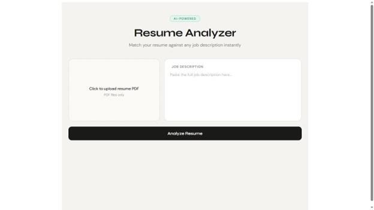
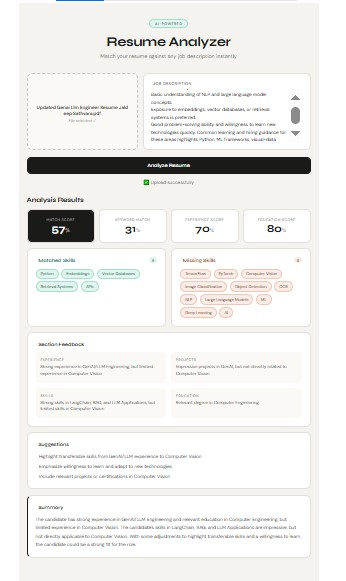

# AI Resume Analyzer

An AI-powered Resume Analyzer built with **FastAPI**, **Angular**, **LangChain**, and **LLMs**.

The application analyzes a resume against a job description and returns a structured match report with scores, matched skills, missing skills, section-wise feedback, improvement suggestions, and a final summary.

---

## Topics

```txt
resume-analyzer
genai
fastapi
angular
llm
embeddings
sentence-transformers
ats
python
langchain
```

---

## Features

- Upload resume PDF
- Paste job description
- Extract resume text from PDF
- Analyze resume against job description
- Generate structured JSON output
- Skill matching using embeddings
- Match score calculation
- Section-wise resume feedback
- Missing skills detection
- Improvement suggestions
- Clean Angular frontend
- FastAPI backend

---

## Tech Stack

### Frontend

- Angular
- TypeScript
- HTML
- CSS

### Backend

- FastAPI
- Python
- LangChain
- Pydantic
- Sentence Transformers
- Scikit-learn
- PDF text extraction

### AI / GenAI

- LLM-based resume analysis
- Structured output parsing
- Embedding-based skill similarity matching
- Prompt engineering

---

## Project Structure

```txt
resume-analyzer/
│
├── backend/
│   ├── main.py
│   ├── requirements.txt
│   ├── services/
│   │   ├── resume_parser.py
│   │   ├── keyword_matcher.py
│   │   ├── ats_analyzer.py
│   │   ├── skill_extractor.py
│   │   ├── pdf_extractor.py
│   │   └── scorer.py
│   ├── models/
│   │   └── schemas.py
│   └── .env.example
│
└── frontend/
    ├── public/
    │   └── assets/
    │       ├── Upload-Page.jpg
    │       └── Analysis-Result.jpg
    ├── src/
    │   └── app/
    │       ├── components/
    │       │   └── analyzer/
    │       │       ├── analyzer.component.ts
    │       │       ├── analyzer.component.html
    │       │       └── analyzer.component.css
    │       ├── services/
    │       │   └── analyzer.service.ts
    │       ├── models/
    │       │   └── analysis.model.ts
    │       └── app.component.ts
    ├── package.json
    └── README.md
```

---

## API Response Format

The backend returns structured analysis in this format:

```json
{
  "match_score": 82,
  "keyword_match": 76,
  "experience_score": 85,
  "education_score": 80,
  "matched_skills": ["Python", "FastAPI", "Angular", "LangChain"],
  "missing_skills": ["Docker", "AWS"],
  "section_feedback": {
    "experience": "Experience section is relevant but can include more measurable impact.",
    "projects": "Projects are strong and aligned with the job description.",
    "skills": "Skills section contains many relevant technologies but misses some JD keywords.",
    "education": "Education section is acceptable for this role."
  },
  "suggestions": [
    "Add Docker if you have basic experience.",
    "Mention measurable results in project descriptions.",
    "Include keywords from the job description naturally."
  ],
  "summary": "The resume is a good match for the role, especially in backend and GenAI-related skills."
}
```

---

## How It Works

1. User uploads a resume PDF.
2. User pastes a job description.
3. Backend extracts text from the resume.
4. Resume skills and job description skills are extracted.
5. Embeddings are generated for both skill sets.
6. Cosine similarity is used to find matched and missing skills.
7. LLM analyzes resume sections and generates feedback.
8. Final structured response is returned to the frontend.

---

## Match Score Logic

The final match score is calculated using multiple factors:

```txt
match_score =
  keyword_match * 0.40 +
  experience_score * 0.35 +
  education_score * 0.25
```

This makes the score more consistent and less dependent only on the LLM.

---

## Backend Setup

### 1. Go to backend folder

```bash
cd backend
```

### 2. Create virtual environment

```bash
python -m venv venv
```

### 3. Activate virtual environment

For Windows:

```bash
venv\Scripts\activate
```

For macOS/Linux:

```bash
source venv/bin/activate
```

### 4. Install dependencies

```bash
pip install -r requirements.txt
```

### 5. Create `.env` file

```env
GROQ_API_KEY=your_groq_api_key_here
HF_TOKEN=your_huggingface_token_here
```

You can also use another LLM provider depending on your backend configuration.

### 6. Run FastAPI server

```bash
uvicorn main:app --reload
```

Backend will run on:

```txt
http://localhost:8000
```

---

## Frontend Setup

### 1. Go to frontend folder

```bash
cd frontend
```

### 2. Install dependencies

```bash
npm install
```

### 3. Run Angular app

```bash
ng serve
```

Frontend will run on:

```txt
http://localhost:4200
```

---

## API Endpoint

### Analyze Resume

```http
POST /analyze/
```

### Request Body

Form data:

| Field | Type | Description |
|---|---|---|
| file | File | Resume PDF |
| jd_text | String | Job description text |

### Example

```bash
curl -X POST http://localhost:8000/analyze/ \
  -F "file=@resume.pdf" \
  -F "jd_text=We are looking for a Python FastAPI developer with LLM experience..."
```

---

## Screenshots

### Upload Page



### Analysis Result



---

## What I Learned

While building this project, I learned:

- How to build a GenAI application using FastAPI and Angular
- How to extract text from resumes
- How to use LangChain for structured LLM output
- How to use embeddings for semantic skill matching
- How to calculate resume-job match scores
- How to design structured JSON responses for frontend usage
- How to combine deterministic logic with LLM-based evaluation

---

## Future Improvements

- Add resume rewrite feature
- Add login and analysis history
- Store analysis results in PostgreSQL
- Add downloadable PDF report
- Add multiple resume comparison
- Improve skill extraction with custom NER
- Add role-specific scoring templates
- Deploy frontend and backend

---

## Author

**Jaldeep Sathvara**

- GitHub: [jaldeepsathvara](https://github.com/jaldeepsathvara)
- Portfolio: [jaldeep.netlify.app](https://jaldeep.netlify.app)
- LinkedIn: [jaldeep-sathvara-479281234](https://linkedin.com/in/jaldeep-sathvara-479281234)

---

## License

This project is open-source and available under the MIT License.
